### Exercise 1

``` r
autoplot(gold)
autoplot(woolyrnq)
autoplot(gas)
frequency(gold)
## [1] 1
frequency(woolyrnq)
## [1] 4
frequency(gas)
## [1] 12
which.max(gold)
## [1] 770
```

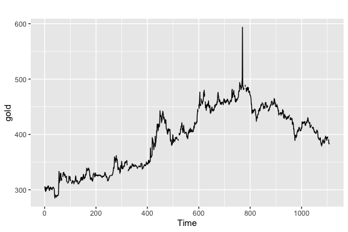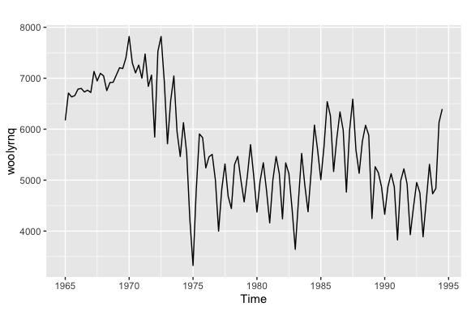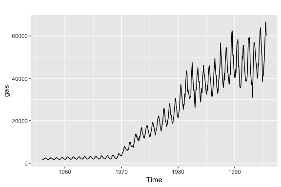

### Exercise 2

``` r
tute1 <- read.csv("Data/tute1.csv")
mytimeseries <- ts(tute1[,-1], start = 1981, frequency = 4)
autoplot(mytimeseries, facets = T)
```

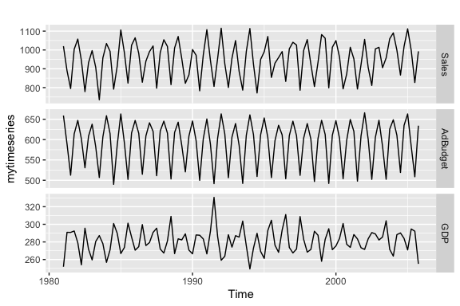

### Exercise 3

``` r
retaildata <- readxl::read_excel("Data/retail.xlsx", skip = 1)
myts <- ts(retaildata[,"A3349873A"], frequency = 12, start = c(1982, 4))
myts
##        Jan   Feb   Mar   Apr   May   Jun   Jul   Aug   Sep   Oct   Nov
## 1982                    62.4  63.1  59.6  61.9  60.7  61.2  62.1  68.3
## 1983  63.9  64.8  70.0  65.3  68.9  65.7  66.9  70.4  71.6  74.9  83.4
## 1984  69.0  71.8  74.9  70.2  76.6  68.7  70.1  74.6  70.6  80.5  87.2
## 1985  73.3  71.1  75.7  76.0  86.1  75.2  83.4  85.3  81.3  93.9 104.7
## 1986  88.5  85.2  86.2  92.4 100.9  90.1  96.1  97.2  96.8 107.7 110.9
## 1987  98.1  94.5  97.7  99.3 106.3  98.5 107.1 105.9 108.5 117.1 121.4
## 1988 109.0 110.7 115.5 105.7 114.3 107.5 108.8 109.6 118.4 125.5 151.8
## 1989 129.4 120.6 133.2 129.3 142.8 127.6 126.0 136.7 144.5 147.8 168.4
## 1990 141.2 139.8 152.1 135.8 148.0 135.8 138.7 144.8 139.9 151.6 163.9
## 1991 135.1 135.5 142.4 137.3 146.5 137.6 147.0 152.9 157.5 169.3 184.8
## 1992 164.4 169.8 171.0 167.5 173.2 150.8 160.9 164.5 173.6 182.7 196.9
## 1993 156.1 152.6 162.0 151.5 160.5 144.9 147.0 151.5 161.6 169.4 186.7
## 1994 159.6 161.0 171.3 152.6 159.5 157.4 156.9 169.6 186.2 206.3 198.3
## 1995 176.6 170.8 179.7 174.9 174.9 169.1 184.9 192.5 201.5 210.5 227.9
## 1996 202.2 210.0 204.5 203.3 209.4 194.8 215.7 228.6 226.6 229.8 242.6
## 1997 228.4 212.9 222.3 217.2 225.4 217.2 228.2 227.9 234.9 257.6 280.7
## 1998 235.6 224.4 219.1 242.2 239.6 230.5 240.5 233.9 242.7 227.3 243.9
## 1999 211.2 197.0 194.3 218.5 222.6 195.0 215.2 222.7 232.6 236.7 252.2
## 2000 219.2 215.2 221.0 212.6 228.6 239.4 201.0 211.4 241.1 253.9 261.2
## 2001 244.9 236.1 249.7 263.4 268.1 248.9 253.3 266.0 262.2 291.6 316.8
## 2002 268.6 248.4 272.4 261.5 283.1 254.4 265.3 284.9 291.2 299.7 332.0
## 2003 271.8 261.3 266.7 275.8 287.3 277.5 285.4 297.1 314.4 323.0 346.5
## 2004 268.5 256.8 270.7 250.9 266.4 255.2 261.0 263.9 276.3 291.2 304.8
## 2005 279.4 255.7 268.3 260.6 260.1 254.4 249.9 262.4 269.9 277.8 303.0
## 2006 265.8 248.7 273.1 261.0 266.3 260.4 268.3 275.9 278.2 284.1 299.2
## 2007 266.0 251.1 269.9 261.7 273.7 254.8 275.2 290.4 306.7 309.8 324.3
## 2008 285.9 286.8 275.3 257.2 285.8 259.7 261.2 273.4 275.2 300.5 323.5
## 2009 290.8 285.2 300.6 294.4 304.9 292.5 305.3 289.1 296.2 298.6 321.0
## 2010 266.2 240.0 267.5 260.7 272.8 260.5 268.5 277.0 278.7 279.0 319.3
## 2011 296.2 302.5 310.8 274.8 267.0 263.8 294.6 317.8 320.4 308.6 427.5
## 2012 288.6 287.1 315.6 291.2 309.3 330.0 327.0 331.1 344.6 366.0 534.2
## 2013 364.5 360.1 400.3 379.4 395.1 373.6 400.1 384.1 388.4 418.2 577.9
##        Dec
## 1982 104.0
## 1983 122.8
## 1984 121.3
## 1985 143.8
## 1986 161.0
## 1987 170.1
## 1988 232.4
## 1989 242.6
## 1990 215.8
## 1991 250.1
## 1992 255.5
## 1993 270.1
## 1994 269.5
## 1995 316.5
## 1996 336.5
## 1997 390.1
## 1998 337.8
## 1999 364.6
## 2000 362.6
## 2001 445.0
## 2002 454.8
## 2003 456.0
## 2004 427.0
## 2005 417.3
## 2006 429.1
## 2007 472.0
## 2008 457.3
## 2009 408.9
## 2010 400.2
## 2011 463.9
## 2012 535.4
## 2013 564.3
```

### Exercise 4

``` r
autoplot(bicoal) + ggtitle("Annual bituminous coal production")
```

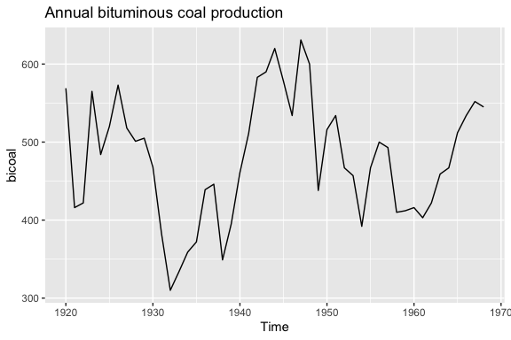

``` r
autoplot(chicken) + ggtitle("Price of chicken in US\n(constant dollars): 1924–1993")
```

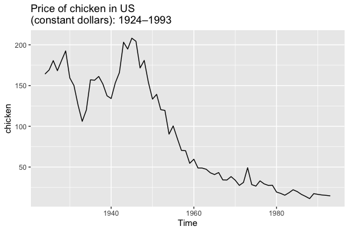

``` r
autoplot(dole) + ggtitle("Monthly total of people on unemployment benefits in Australia")
```

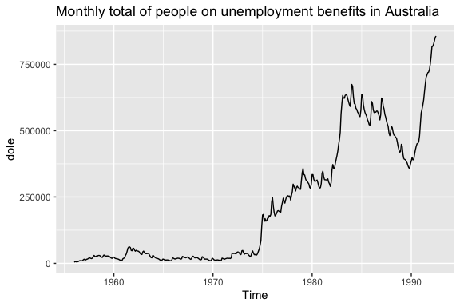

``` r
autoplot(usdeaths) + ggtitle("Monthly accidental deaths in USA.")
```

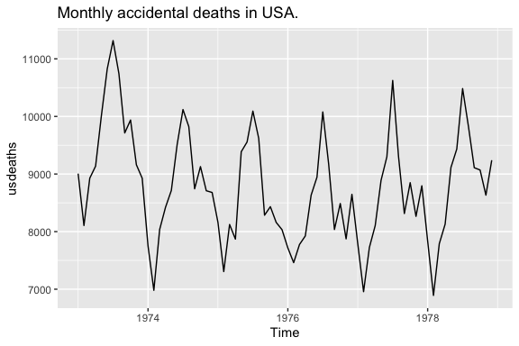

``` r
autoplot(lynx)
```

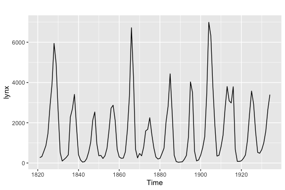

``` r
autoplot(goog) + ggtitle("Daily closing stock prices of Google Inc")
```


``` r
autoplot(fancy) + ggtitle("Monthly sales for a souvenir shop")
```


``` r
autoplot(a10) + ggtitle("Monthly anti-diabetic drug sales in Australia")
```

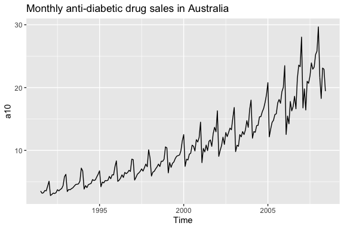

``` r
autoplot(h02) + ggtitle("Australian Monthly corticosteroid drug sales")
```

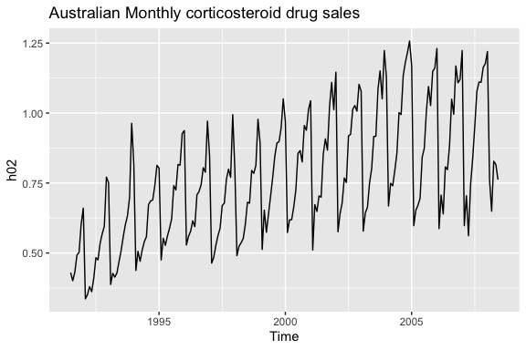

### Exercise 5

``` r
ggseasonplot(writing)
```

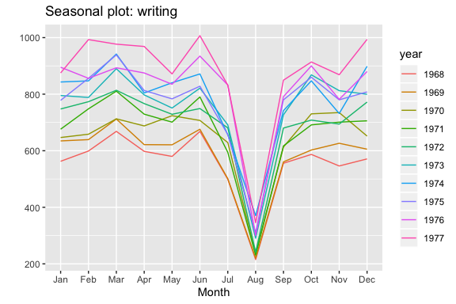

``` r
ggsubseriesplot(writing)
```

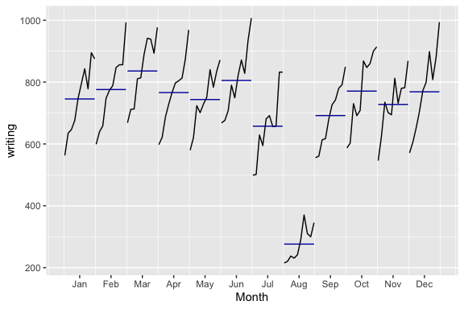

### Exercise 6

``` r
autoplot(hsales)
ggseasonplot(hsales)
ggsubseriesplot(hsales)
```


``` r
autoplot(usdeaths)
ggseasonplot(usdeaths)
ggsubseriesplot(usdeaths)
```

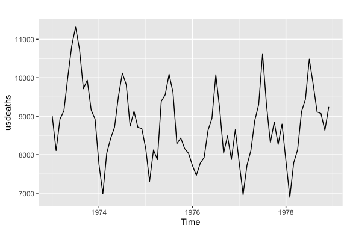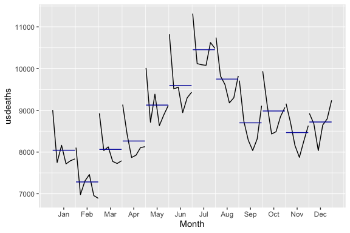

``` r
autoplot(bricksq)
ggseasonplot(bricksq)
ggsubseriesplot(bricksq)
```

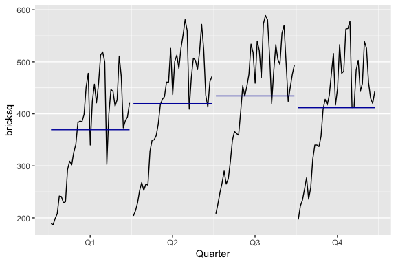

### Exercise 7

``` r
autoplot(arrivals, facets = T)
ggseasonplot(arrivals[,3])
```


### Exercise 8

-   1: B
-   2: A
-   3: D
-   4: C

### Exercise 9

``` r
mypigs <- window(pigs, start = 1990)
frequency(pigs)
## [1] 12
autoplot(mypigs)
ggseasonplot(mypigs)
ggsubseriesplot(mypigs)
```

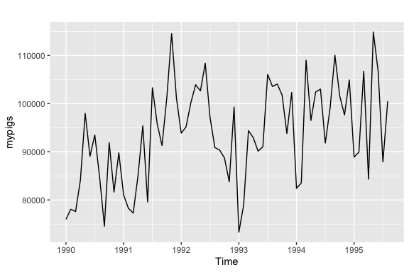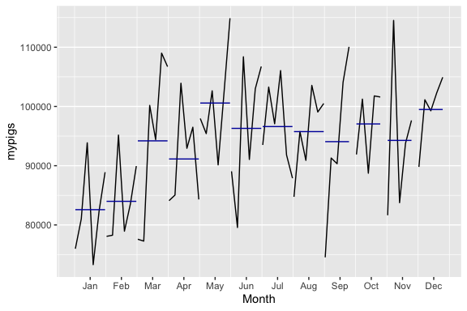

``` r
ggAcf(mypigs)
ggPacf(mypigs)
```

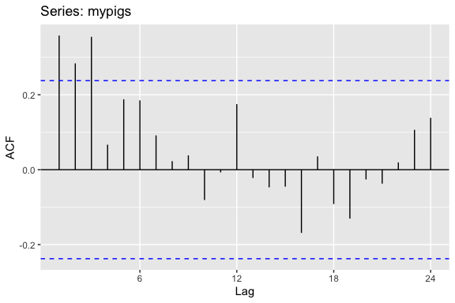

### Exercise 10

``` r
autoplot(dj)
ggAcf(dj)
autoplot(diff(dj))
ggAcf(diff(dj))
```

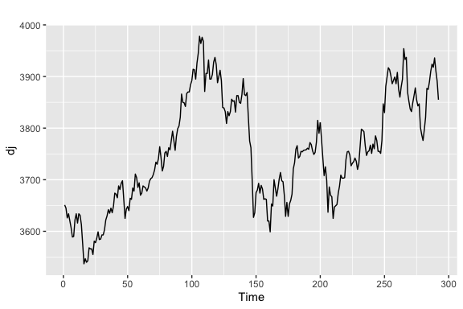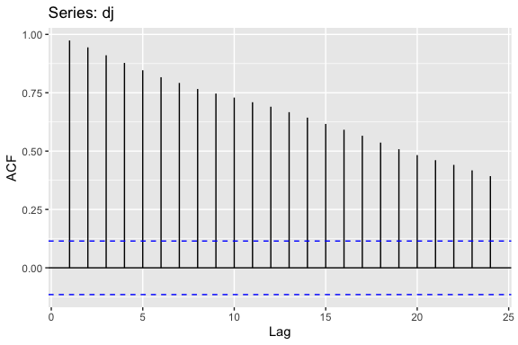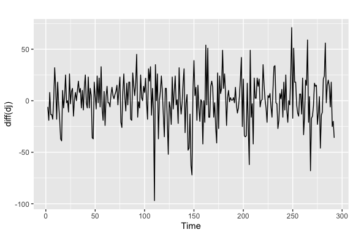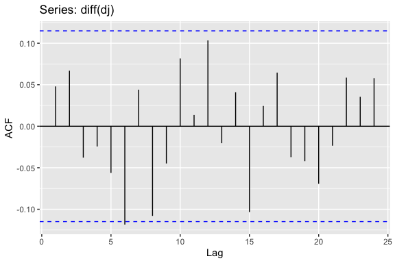
