## Forecasting: Principles and Practice - Chapter 6

### Exercise 2

The `plastics` data set consists of the monthly sales (in thousands) of
product A for a plastics manufacturer for five years.

Plot the time series of sales of product A. Can you identify seasonal
fluctuations and/or a trend-cycle?

  - Sales increase throughout the year, peaking in August and September
    and declining again in the 4th quarter of the year.

<!-- end list -->

``` r
autoplot(plastics)
ggseasonplot(plastics)
ggsubseriesplot(plastics)
```

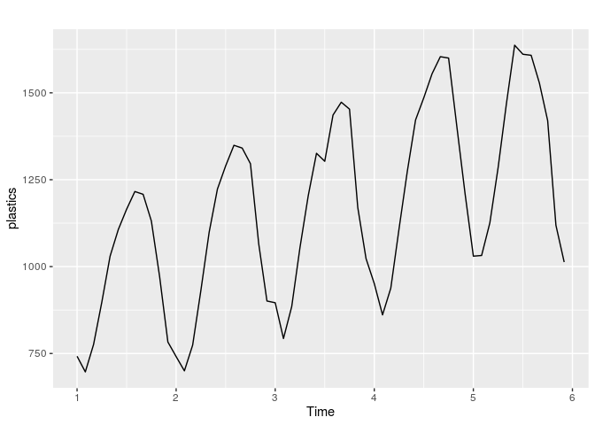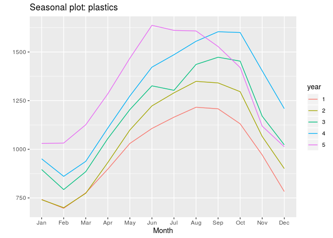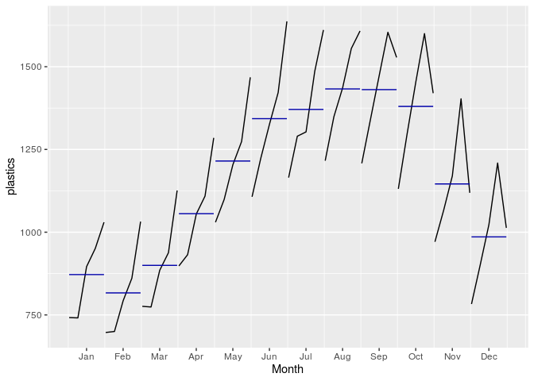

Use a classical multiplicative decomposition to calculate the
trend-cycle and seasonal indices.

``` r
decompose(plastics, type = "multiplicative") %>% 
   autoplot() +
   ggtitle("Classical multiplicative decomposition")
```

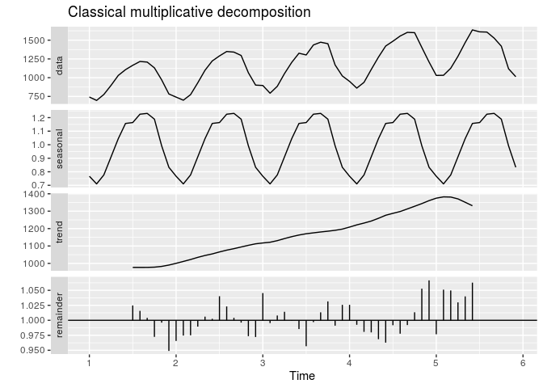

Compute and plot the seasonally adjusted data.

``` r
autoplot(plastics) +
   autolayer(seasadj(decompose(plastics, type = "multiplicative")), series = "Seasonal Adj.") +
   xlab ("Year") + 
   ylab("Monthly Sales")
```

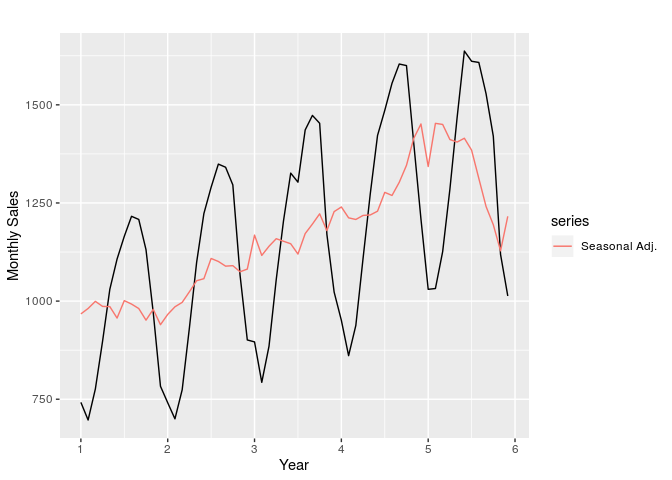

Change one observation to be an outlier (e.g., add 500 to one
observation), and recompute the seasonally adjusted data. What is the
effect of the outlier?

``` r
plastics_adj <- plastics
plastics_adj[17] <- plastics[17] + 500

autoplot(seasadj(decompose(plastics))) + 
   autolayer(seasadj(decompose(plastics_adj)), series = "Seasonal adj.\nwith Outlier")
```

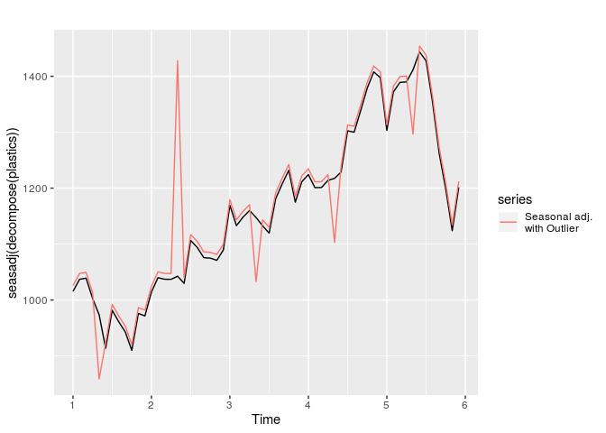

Does it make any difference if the outlier is near the end rather than
in the middle of the time series?

  - Yes, it makes a very big difference where the outlier is. If the
    outlier is at the end of the series, then prior values are not
    significantly impacted. The plot below shows that the seasonal
    adjustment with the outlier towards the end closely matches the
    seasonal adjustment of the original series untial the last few
    observations.

<!-- end list -->

``` r
plastics_adj <- plastics
plastics_adj[58] <- plastics[58] + 500

autoplot(seasadj(decompose(plastics))) + 
   autolayer(seasadj(decompose(plastics_adj)), series = "Seasonal adj.\nwith Outlier")
```

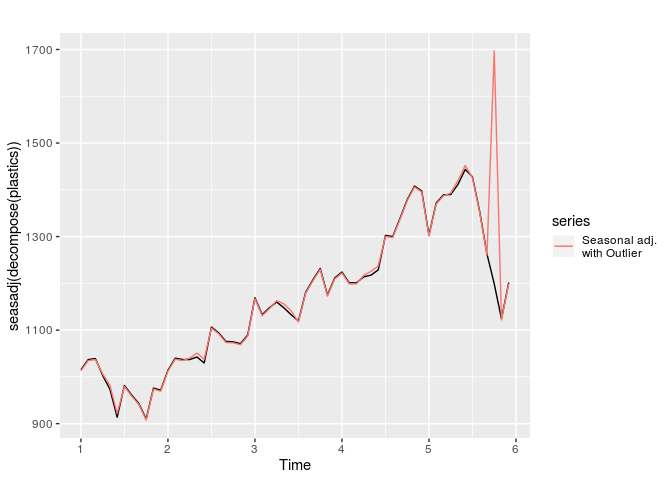

### Exercise 3

Recall your retail time series data (from Exercise 3 in Section 2.10).
Decompose the series using X11. Does it reveal any outliers, or unusual
features that you had not noticed previously?

  - An X11 decomposition of the data reveal a strong change in the trend
    component and decline in seasonal component towards the end of the
    series.

<!-- end list -->

``` r
retaildata <- readxl::read_excel("Data/retail.xlsx", skip = 1)
myts <- ts(retaildata[,"A3349873A"], frequency = 12, start = c(1982, 4))
autoplot(myts)
```

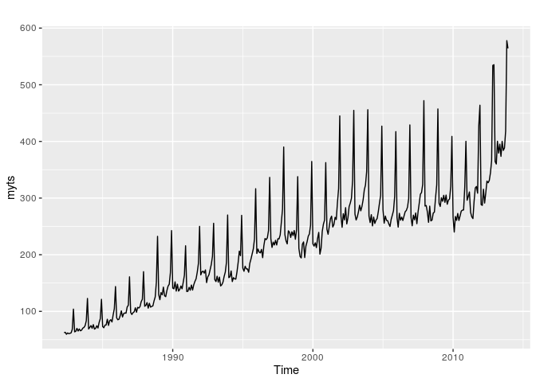

``` r
x11_adj <- seas(myts, x11 = "")
autoplot(x11_adj)
```

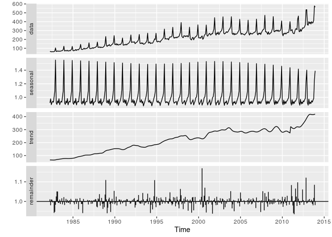

### Exercise 4

Figures
[6.16](https://otexts.com/fpp2/fpp_files/figure-html/labour-1.png) and
[6.17](https://otexts.com/fpp2/fpp_files/figure-html/labour2-1.png) show
the result of decomposing the number of persons in the civilian labour
force in Australia each month from February 1978 to August 1995.

Write about 3–5 sentences describing the results of the decomposition.
Pay particular attention to the scales of the graphs in making your
interpretation.

  - The series decomposition exhibit a strong upwards trend, which
    accounts for the majority of the variation in the series. A very
    small seasonal component reflects staff fluctiations ranging between
    +50 and -50. The residual component of the series is relatively
    small (below 100) for most of the series except for a period just
    after 1990 which shows significant negative residuals of over -300
    to -400.

Is the recession of 1991/1992 visible in the estimated components?

  - Yes, the recession is clearly visible in the residual component of
    the decomposition, which has far stronger negative values than any
    other periods.

### Exercise 5

This exercise uses the `cangas` data (monthly Canadian gas production in
billions of cubic metres, January 1960 – February 2005).

Plot the data using `autoplot()`, `ggsubseriesplot()` and
`ggseasonplot()` to look at the effect of the changing seasonality over
time. What do you think is causing it to change so much?

  - The changes in seasonality could have many causes. One possibility,
    is that larger than usual temperature swings (very warm summers and
    very cold winters) led to greater variation in the demand for gas.

<!-- end list -->

``` r
autoplot(cangas)
ggsubseriesplot(cangas)
ggseasonplot(cangas)
```

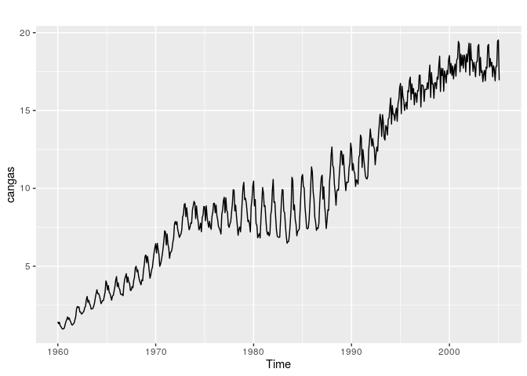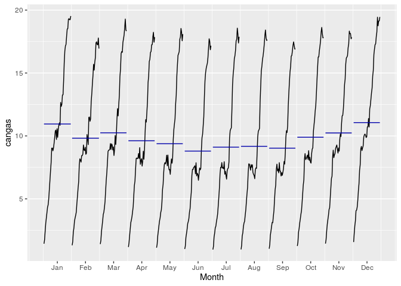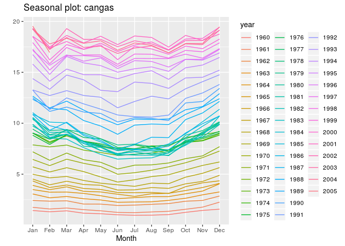

Do an STL decomposition of the data. You will need to choose `s.window`
to allow for the changing shape of the seasonal component.

``` r
cangas_stl <- stl(cangas, s.window = 10)
cangas_x11 <- seas(cangas, x11 = "") 
cangas_seats <- seas(cangas)

stl <- autoplot(cangas) +
   autolayer(seasadj(cangas_stl), series = "Seasonal Adj.") +
   autolayer(trendcycle(cangas_stl), series = "Trend") + 
   ggtitle("Cangas: STL Decomposition")

x11 <- autoplot(cangas) +
   autolayer(seasadj(cangas_x11), series = "Seasonal Adj.") +
   autolayer(trendcycle(cangas_x11), series = "Trend") + 
   ggtitle("Cangas: X11 Decomposition")

seats <- autoplot(cangas) +
   autolayer(seasadj(cangas_seats), series = "Seasonal Adj.") +
   autolayer(trendcycle(cangas_seats), series = "Trend") + 
   ggtitle("Cangas: SEATS Decomposition")

stl + x11 + seats
```

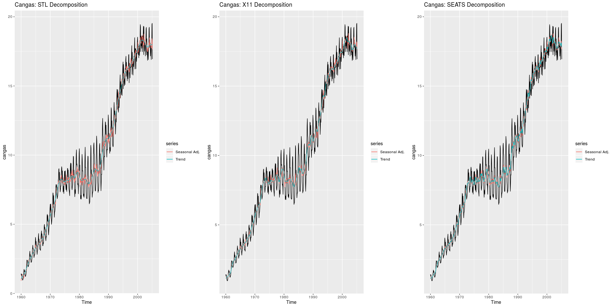<!-- -->

### Exercise 6

We will use the `bricksq` data (Australian quarterly clay brick
production. 1956–1994) for this exercise.

Use an STL decomposition to calculate the trend-cycle and seasonal
indices. (Experiment with having fixed or changing seasonality.)

``` r
autoplot(bricksq) +
   ggtitle("Quarterly clay brick production")
```

<!-- -->

``` r

constant <- autoplot(stl(bricksq, s.window = "periodic", robust = TRUE)) + 
   ggtitle("Quarterly clay brick production: \nSTL decomposition with fixed seasonality")

changing <- autoplot(stl(bricksq, s.window = 10, robust = TRUE)) + 
   ggtitle("Quarterly clay brick production: \nSTL decomposition with changing seasonality")

constant + changing
```

<!-- -->

Compute and plot the seasonally adjusted data.

``` r
bricksq_adj <- seasadj(stl(bricksq, s.window = 10, robust = TRUE))

autoplot(bricksq_adj) + 
   ggtitle("Quarterly clay brick production: Seasonal Adjusted")
```

<!-- -->

Use a naïve method to produce forecasts of the seasonally adjusted data.

``` r
bricksq_fct <- naive(bricksq_adj, h = 8)

autoplot(bricksq_fct)
```

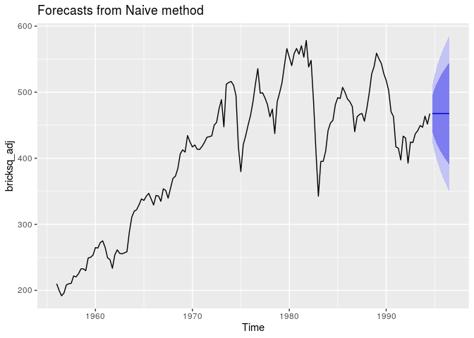<!-- -->

Use `stlf()` to reseasonalise the results, giving forecasts for the
original data.

``` r
stl_fct <- stlf(bricksq, h = 8, method = "naive")

autoplot(stl_fct)
```

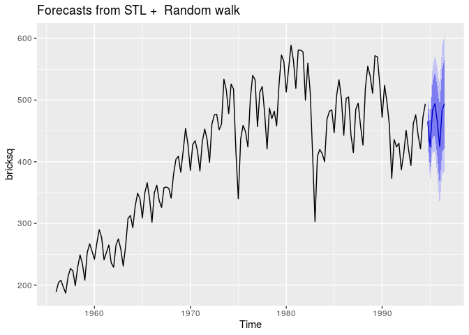<!-- -->

Do the residuals look uncorrelated?

  - The residuals do not appear uncorrelated. A Ljung-Box test for
    autocorrelation rejects the null hypothesis of no autocorrelation in
    the residuals at the 1% significance level. Additionally, an ACF
    plot shows significant autocorrelation at lags 1, 5 and 8.

<!-- end list -->

``` r
checkresiduals(stl_fct)
## Warning in checkresiduals(stl_fct): The fitted degrees of freedom is based
## on the model used for the seasonally adjusted data.
```

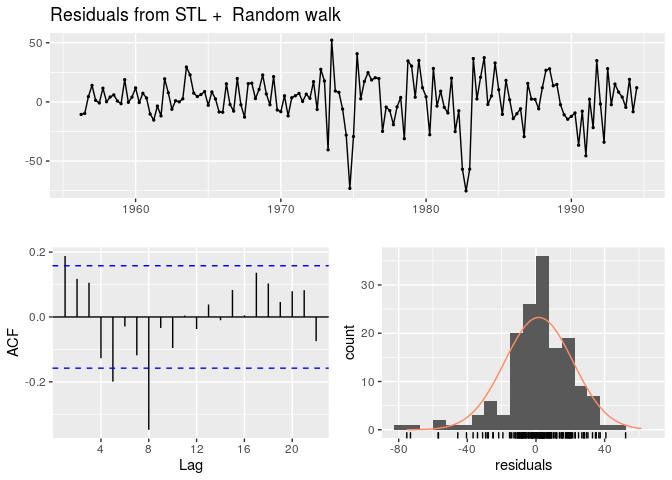<!-- -->

    ## 
    ##  Ljung-Box test
    ## 
    ## data:  Residuals from STL +  Random walk
    ## Q* = 40.829, df = 8, p-value = 2.244e-06
    ## 
    ## Model df: 0.   Total lags used: 8

Repeat with a robust STL decomposition. Does it make much difference?

  - Using a robust does not make a significant difference in reducing
    residual autocorrelation.

<!-- end list -->

``` r
stl_fct_robust <- stlf(bricksq, h = 8, method = "naive", robust = TRUE)

checkresiduals(stl_fct_robust)
## Warning in checkresiduals(stl_fct_robust): The fitted degrees of freedom is
## based on the model used for the seasonally adjusted data.
```

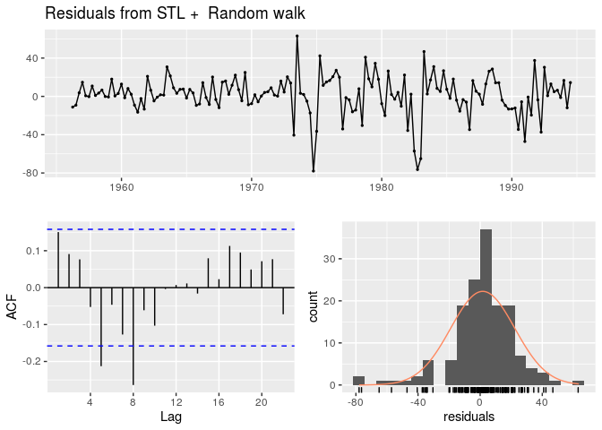<!-- -->

    ## 
    ##  Ljung-Box test
    ## 
    ## data:  Residuals from STL +  Random walk
    ## Q* = 27.961, df = 8, p-value = 0.0004817
    ## 
    ## Model df: 0.   Total lags used: 8

Compare forecasts from stlf() with those from snaive(), using a test set
comprising the last 2 years of data. Which is better?

  - According to the RMSE and MASE, the STL forecasting method provides
    both better in sample and out of sample predictions.

<!-- end list -->

``` r
train <- window(bricksq, start = 1956, end = c(1992, 3))
test <- window(bricksq, start = c(1992, 4))

slf_fct <- stlf(train, h = 8, method = "naive")
snaive_fct <- snaive(train, h = 8)

autoplot(train) + 
   autolayer(slf_fct, PI = FALSE, alpha = 0.5) + 
   autolayer(snaive_fct, PI = FALSE, color = "red", alpha = 0.5)

# accuracy of STL forecast
accuracy(slf_fct, test)
#accuracy of seasonal naive forecast
accuracy(snaive_fct, test)
```

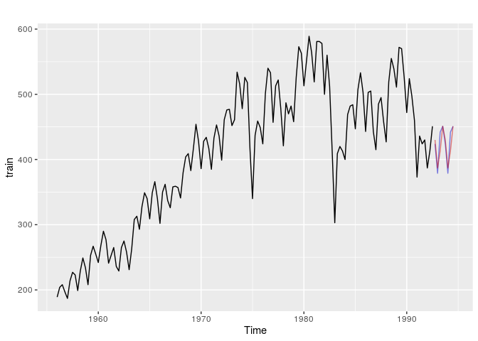<!-- -->

    ##                     ME     RMSE      MAE       MPE     MAPE      MASE
    ## Training set  1.457806 20.31551 14.65964 0.3594803 3.606373 0.4025982
    ## Test set     23.795651 27.73302 24.77223 5.2310577 5.463576 0.6803205
    ##                   ACF1 Theil's U
    ## Training set 0.2005515        NA
    ## Test set     0.2530477 0.7247275
    ##                     ME     RMSE      MAE      MPE     MAPE      MASE
    ## Training set  6.174825 49.71281 36.41259 1.369661 8.903098 1.0000000
    ## Test set     27.500000 35.05353 30.00000 5.933607 6.528845 0.8238909
    ##                   ACF1 Theil's U
    ## Training set 0.8105927        NA
    ## Test set     0.2405423 0.9527794

### Exercise 7

Use `stlf()` to produce forecasts of the `writing` series with either
`method = "naive"` or `method = "rwdrift"`, whichever is most
appropriate. Use the lambda argument if you think a Box-Cox
transformation is required.

  - A random walk with drift forecast using STL decomposition provides
    better in-sample fit than the naive method.

<!-- end list -->

``` r
autoplot(writing) + 
   ggtitle("Sales of printing and writing paper") + 
   ylab("Thousands of French Francs")
```

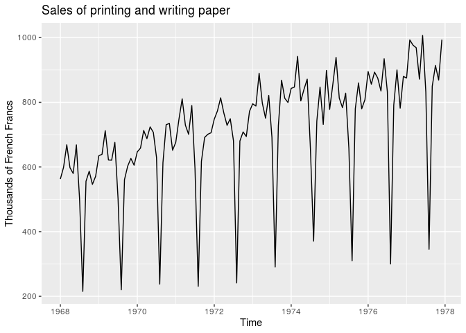<!-- -->

``` r
naive_fct <- stlf(writing, h = 12, method = "naive")
rwdrift_fct <- stlf(writing, h = 12, method = "rwdrift")

autoplot(naive_fct)
```

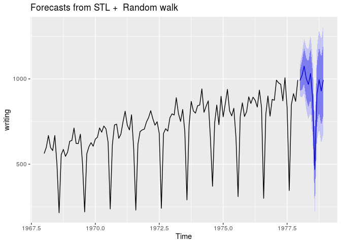<!-- -->

``` r

autoplot(rwdrift_fct)
```

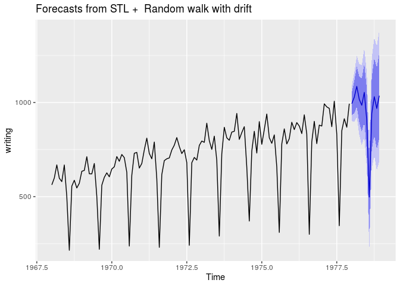<!-- -->

``` r

accuracy(naive_fct)
##                    ME    RMSE      MAE       MPE     MAPE      MASE
## Training set 3.537169 46.6923 37.81126 0.3325985 6.197585 0.7734397
##                    ACF1
## Training set -0.5434606
accuracy(rwdrift_fct)
##                         ME     RMSE      MAE        MPE     MAPE      MASE
## Training set -3.152695e-14 46.55813 37.83434 -0.2183412 6.217677 0.7739118
##                    ACF1
## Training set -0.5434606
```

### Exercise 8

Use `stlf()` to produce forecasts of the `fancy` series with either
`method = "naive"` or `method = "rwdrift"`, whichever is most
appropriate. Use the lambda argument if you think a Box-Cox
transformation is required.

``` r
autoplot(fancy) +
   ggtitle("Sales for a souvenir shop")
```

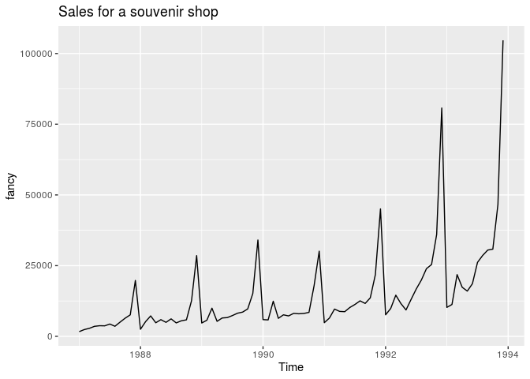<!-- -->

``` r
fancy_fct <- stlf(fancy, h = 12, method = "rwdrift", lambda = BoxCox.lambda(fancy))

autoplot(fancy_fct)
```

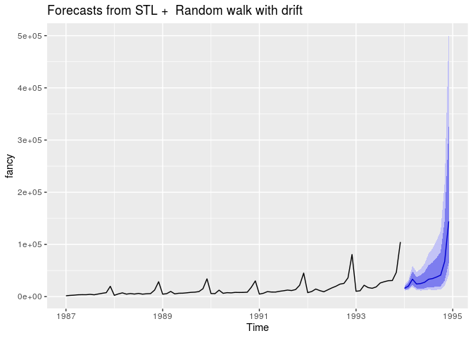<!-- -->
